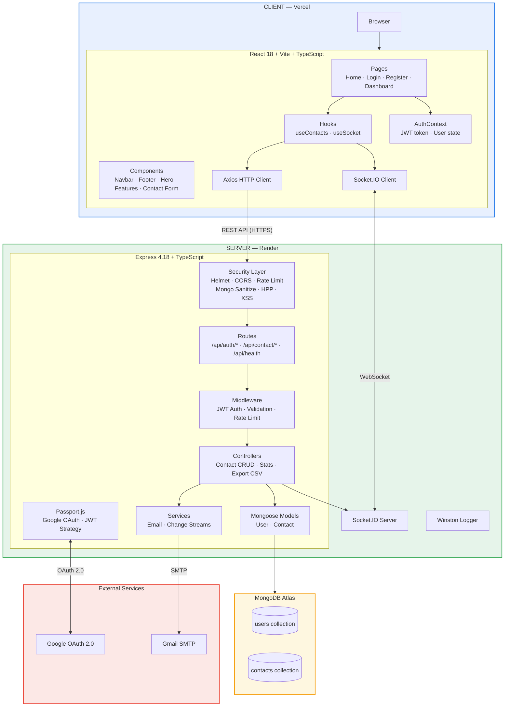
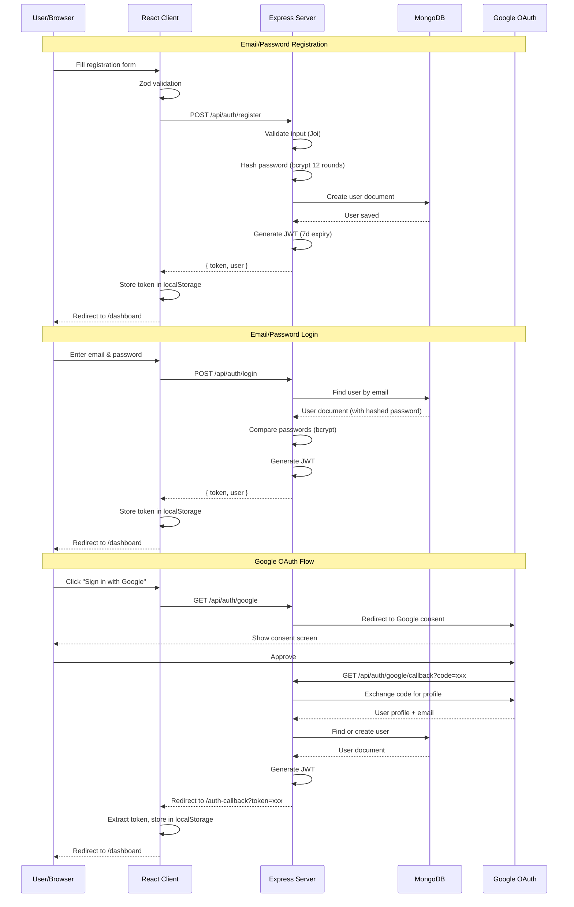
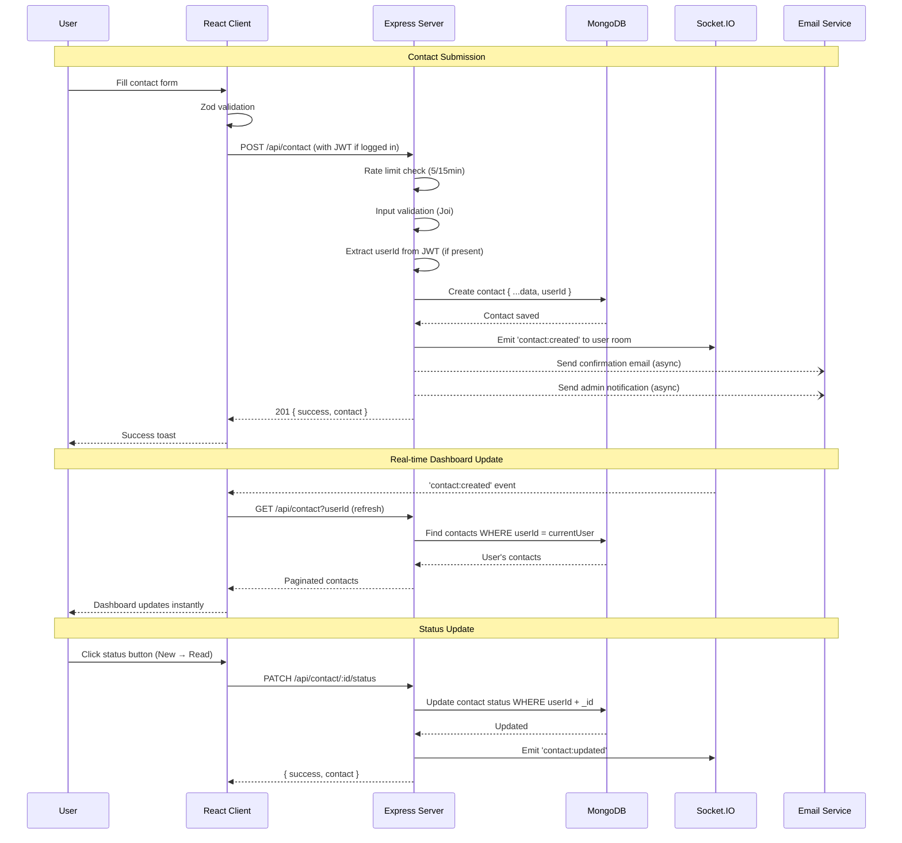
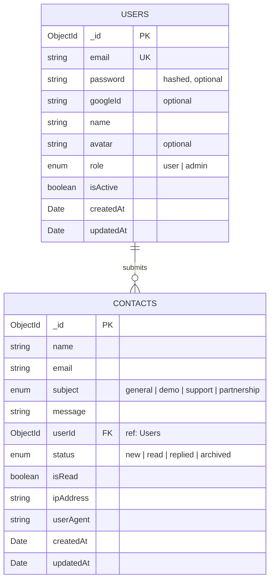
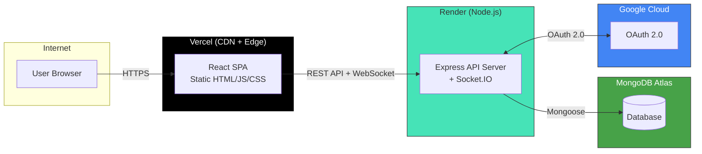

# TechFlow — Architecture Diagram Prompts

Use the prompts below to generate visual architecture diagrams with AI tools (ChatGPT, Claude, Gemini) or paste the Mermaid code into [mermaid.live](https://mermaid.live).

---

## 1. System Architecture — Mermaid Diagram

Copy this Mermaid code directly into any Mermaid renderer:

---

## 2. Authentication Flow — Mermaid Sequence Diagram

---

## 3. Contact Lifecycle — Mermaid Sequence Diagram

---

## 4. Data Model — Mermaid ER Diagram

---

## 5. Deployment Architecture — Mermaid Diagram

---

## 6. AI Prompt for Architecture Diagram Generation

Use this prompt with ChatGPT, Claude, or other AI tools to generate a custom architecture diagram:

> **Prompt:**
>
> Generate a professional architecture diagram for a full-stack web application called "TechFlow" with these specifications:
>
> **Frontend (deployed on Vercel):**
> - React 18 with TypeScript and Vite build tool
> - Tailwind CSS for styling, Framer Motion for animations
> - React Router DOM for client-side routing (Home, Login, Register, Dashboard)
> - Axios for HTTP requests to the backend API
> - Socket.IO client for real-time WebSocket communication
> - Zustand-style AuthContext for state management
> - React Hook Form + Zod for form validation
>
> **Backend (deployed on Render):**
> - Node.js with Express 4.18 and TypeScript
> - Security middleware stack: Helmet, CORS, express-rate-limit (tiered: general 100/15min, auth 20/15min, contact 5/15min), express-mongo-sanitize, HPP, XSS-clean
> - Authentication: Passport.js with Google OAuth 2.0 strategy + JWT strategy, bcryptjs for password hashing
> - RESTful API with routes: /api/auth/* (register, login, google, me, logout) and /api/contact/* (CRUD, stats, export CSV)
> - Socket.IO server for real-time events with user-specific rooms (user:<userId>)
> - Winston logger with console and file transports
> - Nodemailer for email notifications (Gmail SMTP)
> - MongoDB Change Streams for real-time data watching
>
> **Database (MongoDB Atlas):**
> - Two collections: `users` (email, password, googleId, name, avatar, role) and `contacts` (name, email, subject, message, userId reference, status)
> - Per-user data isolation: contacts are scoped by userId in all queries
>
> **Key flows to show:**
> 1. User registers/logs in → JWT issued → stored in localStorage → sent as Bearer token
> 2. Google OAuth: redirect to Google → callback → JWT issued → redirect to client
> 3. Contact form submitted → saved to MongoDB with userId → Socket.IO emits to user room → Dashboard updates in real-time
> 4. Polling fallback: 15-second HTTP polling when WebSocket is unavailable
>
> Style the diagram with Google-inspired colors (blue #1a73e8, green #34a853, yellow #f59e0b, red #ea4335). Use clean, modern formatting suitable for a project report or portfolio.
